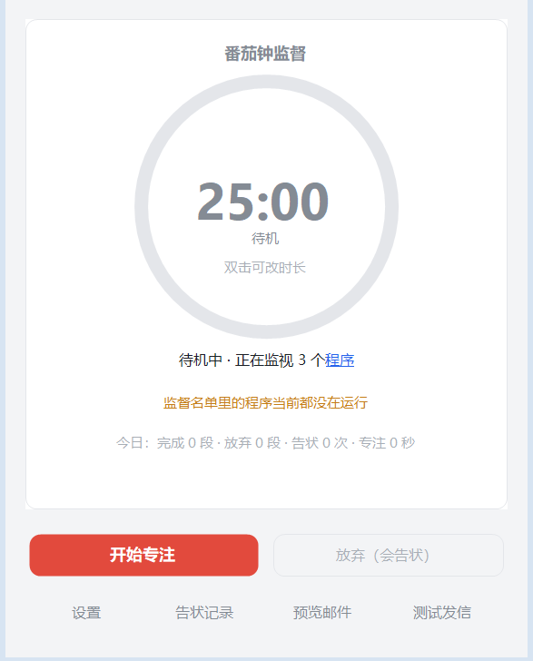

# 🍅 PomoCC · 番茄钟监督

> 没坚持完专注？偷偷玩游戏？它会给你的监督人发一封告状邮件。

**Focus, or I CC (emails) your supervisor. —— Windows 桌面番茄钟 + 监督名单进程监测 + 自动告状邮件。**
单文件 `exe`（约 150 KB），不需要安装、不需要 .NET SDK、不引任何第三方库 —— 用 Windows 自带的 .NET Framework 编译器直接产出。

<p>
  
  
  
  
  
</p>



---

## 这是什么

一个**把「我在专注」变成有代价的事**的小工具。

普通番茄钟只能约束愿意被约束的人 —— 心烦的时候顺手就把窗口关了。PomoCC 换了个思路：
你自己指定一个**监督人邮箱**（导师、同学、对象、自己的另一个邮箱都行），然后

- 🚨 番茄钟没走完就点「放弃」→ **立刻**给他发一封邮件；
- 🎮 专注期间，你名单里的程序（比如 `game.exe`）累计运行超过了它自己的规则时长 → **立刻**发一封邮件；
- 🤫 正常走完，它一句话都不说。

邮件里写清楚：**哪个程序、玩了多久、计划专注多久、实际专注了多久、完整时间线**。
退出程序和打开设置都需要密码，防止自己一时冲动把它关掉。

## ✨ 功能

### 番茄钟
- 环形倒计时，默认 25 分钟；**双击中间的大号时间**即可改时长（下拉选常用值，也能手填）
- 倒计时在系统托盘常驻，关窗口不退出，可选择开机自启
- 睡眠/挂起期间不计入专注时长
- **走完时会提醒你**：托盘气泡 + 系统提示音（在「设置 → 规则与其他」里可分别关掉，默认都开）。
  正常完成**不会**给监督人发邮件 —— 这一步只是提醒你自己该休息了

### 监督名单
- 表格四列：**名称（可改）| 软件 | 规则时长（分钟）| 操作**
- 「软件」列是程序自己报的名字 + 进程名（例如 `game · game.exe`），只读，用来认人
- 「名称」列是你自己起的名字，默认和「软件」列一样，双击就能改。
  很多游戏的 exe 自报名字只是 `game` 这种代称，改成「奶龙」之后，**邮件里写的就是「奶龙（game.exe）」**，
  监督人一看就懂
- 添加程序有两条路：**从正在运行的程序里多选**（带图标、可搜索、可切换到后台进程），或者直接选 exe 文件
- 每个程序有**各自**的规则时长

### 告状邮件
- **只有两种情况会发信**：没坚持完（点「放弃」）、某个程序超时。正常完成不发
- 邮件正文分三部分：**你自定义的开头** + **程序固定生成的运行数据** + **你自定义的结尾**
- 「内容自定义」里可改邮件标题、开头、结尾，支持占位符：
  `{名字}` `{时间}` `{日期}` `{时刻}` `{原因}` `{简述}` `{计划专注}` `{实际专注}` `{监督人}`
  `{程序明细}` `{今日累计}` `{时间线}`
- 程序统计的数据块（**每个软件的累计使用时长、启动时间、时间线、今日累计**）不来自自定义内容，
  用户改不掉、也不会不小心删掉
- 发送方式四种邮箱授权码通道 + 四种 HTTP 通道：
  SMTP（**465 隐式 SSL** / 587 STARTTLS）、Resend、SendGrid、Brevo、自定义 HTTP 接口
- 发送结果**如实记录**：`已发送` / `发送失败（附服务器返回的错误）`，失败的可以在「告状记录」里一键**重发**
- 界面里可以「预览告状邮件」「发送测试邮件」，不用等到真触发才知道长什么样

### 防自己
- 退出、打开设置都要密码（PBKDF2-SHA1 × 60000 + 随机盐，只存散列）
- 首运行引导设置密码；点「取消」会用默认密码 `123456` 并明确告知

## 下载与使用

1. 到 [Releases](../../releases) 下载 **`PomoCC-番茄钟监督.exe`** 和同名的 **`.exe.config`**
   （文件名固定、不随版本变化，所以升级时直接覆盖同名文件即可，注册表里的开机自启路径也不用改；两个文件必须放在同一个目录里，`.config` 是用来关掉框架自动 DPI 缩放的，删了界面会糊）
2. 双击运行。首次运行会让你设一个「退出 / 打开设置」用的密码 —— **记牢，忘了只能删配置重来**
3. 进「设置 → 邮件设置」填监督人邮箱和发件邮箱（见下一节）
4. 回主界面点「开始专注」

> 仓库目前还没有 Release 包，你也可以按下面的「从源码构建」自己编译，一分钟出结果。

**它是绿色软件：** 不写系统目录、不装服务、不加驱动。
卸载 = 删掉 exe 目录，再删掉数据目录 `%APPDATA%\PomoCC\`；
如果开过开机自启，在设置里关掉即可（它会删掉注册表里 `HKCU\...\Run\PomoCC` 这一项）。

## 📧 配置发信邮箱

告状邮件用**你自己的邮箱**发出，需要一个「授权码」（不是邮箱登录密码）。

<details>
<summary><b>QQ 邮箱（推荐，免费）</b></summary>

1. 网页版邮箱 → 设置 → 账户 → 开启 **POP3/SMTP 服务** → 生成 **16 位授权码**
2. 在 PomoCC 里填：SMTP 服务器 `smtp.qq.com`，端口 `587`，勾选 STARTTLS，授权码填上一步生成的
3. 点「测试连接」→「发送测试邮件」确认能收到
</details>

<details>
<summary><b>163 邮箱</b></summary>

SMTP 服务器 `smtp.163.com`，端口 **465**，**取消勾选** STARTTLS（程序会自动改用 SSL），
授权码在网页版「设置 → POP3/SMTP/IMAP」里开启并生成。
</details>

<details>
<summary><b>Gmail</b></summary>

需要先开启两步验证并生成**应用专用密码**，服务器 `smtp.gmail.com`，端口 `587`，勾选 STARTTLS。
</details>

不想用 SMTP 也可以用 Resend / SendGrid / Brevo 的 API，或者填一个自己的 HTTP 接口。

## 🔨 从源码构建

只需要一台 Windows（Win10/11 自带 .NET Framework 4.x），**不需要装 .NET SDK、不需要 NuGet**：

```powershell
pwsh -File .\build.ps1
# 或 Windows PowerShell： powershell -File .\build.ps1
```

产物在 `dist\`：

```
dist\PomoCC-番茄钟监督.exe          ← 单文件程序（约 150 KB）
dist\PomoCC-番茄钟监督.exe.config   ← 必须与 exe 放在一起
dist\使用说明.txt            ← 面向非技术用户的图文说明
```

几个刻意为之的设计：

| 设计 | 原因 |
|---|---|
| 用系统自带的 `C:\Windows\Microsoft.NET\Framework64\v4.0.30319\csc.exe` 直接编译 | 目标机器零安装、零依赖；产物小到 150 KB |
| 全部界面控件自绘（`Theme.cs` + `Ui.cs`） | 默认 WinForms 控件是十多年前的观感；不引第三方 UI 库 |
| 自己实现 SMTP 客户端（`SmtpTransport.cs`） | .NET 自带的 `SmtpClient` **不支持 465 端口隐式 SSL**，而国内邮箱大量使用 465 |
| 自己做 DPI 缩放（`Dpi.cs` + `app.manifest`） | 框架的自动缩放在实测里被叠加了两次，结果不可预测 |
| `build.ps1` 保持纯 ASCII | Windows PowerShell 会把无 BOM 的脚本按 ANSI 解码，脚本里直接写中文会乱码；中文产物名从 `exe-name.txt` 显式按 UTF-8 读取 |

修改界面代码前请先读 [`AGENTS.md`](AGENTS.md)：里面记着 DPI 缩放、自绘控件擦背景、
「离屏渲染 ≠ 真实渲染」等一连串真实踩过的坑，能省掉几个小时。

## 自检与测试

程序内置了一整套无界面自检（源码在 `src/SelfTest.cs`），改完代码请跑一遍：

```powershell
$exe = '.\dist\PomoCC-番茄钟监督.exe'
& $exe --selftest    .\tests\selftest.log      # 逻辑：配置往返/迁移、DPAPI、密码、规则阈值、状态机、邮件正文
& $exe --smoketest   .\tests\smoketest.log     # 真实创建四个窗口并跑计时器
& $exe --rendertest  .\tests\rendertest.log    # 把按钮/整窗渲染成位图数像素（文字重影、背景没擦、黑边）
& $exe --dpicheck    .\tests\dpicheck.log      # DPI 感知 + 四个窗口 + 三个设置页签的布局零溢出
& $exe --realsmoke   .\tests\realsmoke.log     # 注册表自启往返、托盘图标、单实例互斥、密钥不明文落盘
& $exe --shot        .\tests\shots             # 每个窗口渲染成 PNG，交付前逐张看
& $exe --loadcheck   .\tests\loadcheck.log "%APPDATA%\PomoCC\config.json"   # 旧配置兼容
& $exe --smtp-check  .\tests\probe.log smtp.qq.com 587                                  # SMTP 握手（不登录）
# 端到端发信（本地假 SMTP，不发真邮件）
node .\tools\fake-smtp.mjs 2560 .\tests\e2e-message.txt .\tests\e2e-session.txt .\tests\e2e-live.log
& $exe --mail-test   .\tests\mailtest.log 127.0.0.1 2560
```

自检**不会**碰你的真实配置和真实开机自启项（用临时数据目录 + 测试专用注册表值名），
跑完会自己清理临时目录。要留着排查用 `POMOCC_KEEP_TEMP=1`。

## 工作原理

1. 专注开始后，每 `采样间隔`（默认 5 秒）枚举一次进程，命中「监督名单」的进程按**各自的规则时长**累加运行时间
2. 任一条超时 → 生成告状邮件并在**后台线程**发送（不阻塞界面），期间即使点「放弃」也不会重复发信（一段专注最多一封）
3. 每秒 tick 检查实际间隔，超过 15 秒视为睡眠/挂起，那一段不计入专注时长
4. 点「放弃」时把「计划 vs 实际」和完整时间线一起写进邮件
5. 只有拿到发送结果后才写「告状记录」：`已发送` 或 `发送失败（附错误）`

## 🔒 隐私与安全

- **没有账号、没有遥测、没有云同步。** 程序只在你配置了发信邮箱后才会联网，且只发告状邮件/测试邮件
- 所有数据都在本机 `%APPDATA%\PomoCC\`：`config.json`（设置）、`history.jsonl`（告状记录）、`stats.json`（今日计数）、`app.log`
- 邮箱授权码 / API Key 用 **Windows DPAPI**（`ProtectedData`）加密，绑定当前 Windows 用户 —— 配置文件被拷走也读不出密钥
- 退出密码只存 **PBKDF2-SHA1（60000 次迭代 + 随机盐）** 的散列
- 写开机自启项是**幂等**的：值没变化就一个字节都不写注册表（否则安全软件会把每次启动都当成「企图开机自启动」而反复弹窗）

> **诚实说明**：密码只是**增加阻力**，不是安全边界。任务管理器结束进程、删掉配置文件都能绕过它。
> 这是自律工具，不是家长控制软件 —— 它假设你希望被拦一下，而不是被强制拦住。

## 已知限制

- 只支持 Windows（WinForms + 系统自带 .NET Framework 4.x）
- 只能判断「某个进程在不在跑」，无法知道你到底是在玩还是在工作；如果要用浏览器摸鱼，得把浏览器也加进名单
- 需要你自备一个能发信的邮箱（授权码）
- 只统计「今日」几个计数，没有历史趋势图
- 多显示器、不同缩放比例切换的场景测试覆盖有限

## 项目结构

```
PomoCC/
├─ build.ps1                 编译脚本（纯 ASCII，详见上文）
├─ exe-name.txt              产物文件名（中文放在这里，规避脚本编码问题）
├─ src/                      全部 C# 源码（无第三方依赖）
│  ├─ App.cs                 入口、单实例互斥、命令行模式、开机自启
│  ├─ Theme.cs / Ui.cs       配色字体 + 自绘控件库（按钮/卡片/输入框/环形倒计时）
│  ├─ Dpi.cs                 自己的 DPI 缩放
│  ├─ Settings.cs / Store.cs 设置模型、持久化、DPAPI、密码散列、旧配置迁移
│  ├─ Monitor.cs             按规则枚举受监视进程
│  ├─ AppCatalog.cs          枚举本机正在运行的程序（图标/描述/窗口标题）
│  ├─ Supervisor.cs          专注状态机与逐条规则判定（核心逻辑，与界面解耦）
│  ├─ Mailer.cs              邮件主题/正文生成（含占位符替换）
│  ├─ SmtpTransport.cs       自带 SMTP 客户端（465 隐式 SSL / 587 STARTTLS）
│  ├─ HttpSender.cs          Resend / SendGrid / Brevo / 自定义 HTTP
│  ├─ MainForm.cs / SettingsForm.cs / AppPickerForm.cs / Dialogs.cs   界面
│  └─ SelfTest.cs            全部自检
├─ docs/
│  ├─ 使用说明.txt            面向非技术用户的说明（构建时会复制到 dist/）
│  └─ images/                README 用的截图
├─ tools/fake-smtp.mjs       端到端测试用的假 SMTP 服务器（Node）
└─ tests/                    自检输出（日志/截图），不入库
```

## 参与贡献

欢迎提 Issue 和 PR。动手改代码前建议先看 [`AGENTS.md`](AGENTS.md)（开发笔记与踩坑记录），
提交前请把你改动的部分对应的自检跑一遍（至少 `--selftest`、`--dpicheck`、`--rendertest`）。

## 📄 许可证

[Apache License 2.0](LICENSE)

---

**版本 0.2** —— 监督核心改为独立后台计时（界面卡住不再少算专注时间）、正确处理睡眠/休眠，
进程按「PID + 启动时间」识别实例、规则按 exe 汇总；发信入口加了地址校验与连接超时，
手动测试/重发改到后台线程，数据迁移失败可重试。详见 [CHANGELOG.md](CHANGELOG.md)。
