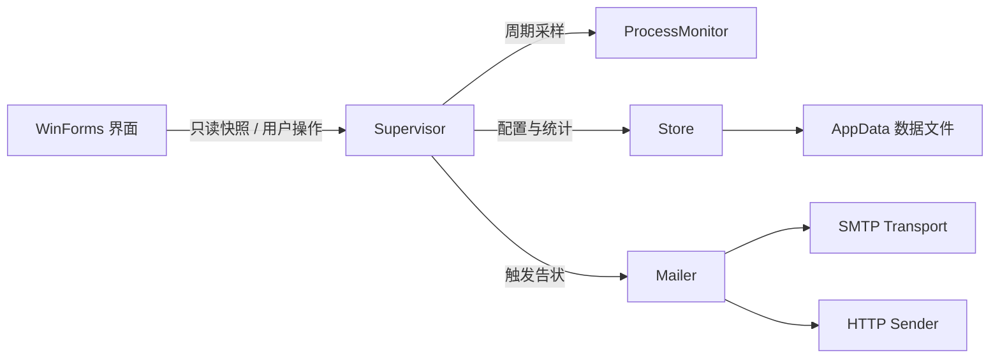

# PomoCC 技术实现与安全设计

> 本文适用于 PomoCC 0.2.0，面向希望审查实现、评估安全边界或参与开发的读者。

PomoCC 是一个 Windows 桌面专注监督工具。它在本机维护专注会话、周期性检查指定进程，并在放弃专注或监督程序超时后发送通知邮件。程序基于 C# WinForms 和 .NET Framework 4.x，不依赖第三方运行时库。

## 设计目标

核心设计围绕以下目标展开：

- 计时不依赖 UI 消息循环，界面卡顿不能导致专注时间停止。
- 监督规则在一段专注开始时固定，避免中途改设置改变当前会话结果。
- 同名多进程按实例记录，但同一规则的时间预算不会被重复扣除。
- 邮件发送不阻塞界面，并明确记录最终发送结果。
- 配置写入失败时保留原文件，避免一次异常破坏可用数据。
- 卸载操作只删除明确属于 PomoCC 的文件、注册表值和数据目录。

PomoCC 不以对抗拥有本机控制权的用户为目标。它是自我约束工具，不是家长控制、终端防护或审计系统。

## 系统结构



主要模块如下：

| 模块 | 职责 |
|---|---|
| `App.cs` | 程序入口、单实例互斥、命令行测试模式、开机自启 |
| `MainForm.cs` / `SettingsForm.cs` | 主界面、设置界面、托盘交互 |
| `Supervisor.cs` | 专注状态机、后台计时、进程采样、规则判定、告状调度 |
| `Monitor.cs` | 枚举系统进程并匹配监督规则 |
| `Settings.cs` | 配置模型、输入校验、DPAPI、密码散列 |
| `Store.cs` | 配置、统计、历史与日志的持久化 |
| `Mailer.cs` | 邮件主题、正文和固定数据块的生成 |
| `SmtpTransport.cs` | SMTP、隐式 SSL 和 STARTTLS |
| `HttpSender.cs` | Resend、SendGrid、Brevo 和自定义 HTTP 接口 |
| `AsyncMail.cs` | 手动测试、连接测试和历史重发的异步 UI 外壳 |
| `uninstaller/Program.cs` | 程序、自启项和本地数据的受限清理 |

## 专注计时模型

### 后台单调时钟

专注会话由独立后台线程推进。线程约每 200 毫秒调用一次状态机，时间来源为 `Stopwatch` 单调时钟，而不是 UI 定时器或系统墙上时间。

UI 定时器只负责刷新显示。即使主线程短暂卡顿，后台监督和专注计时仍会继续运行。界面通过加锁后的只读快照获取状态，不直接访问后台线程正在修改的会话对象。

### 睡眠与挂起

程序同时使用两种机制识别系统睡眠或长时间挂起：

- 监听 Windows 电源状态的挂起与恢复事件；
- 当连续两次后台推进之间超过 15 秒时，将该段视为未知中断。

被识别为中断的时间既不计入专注时间，也不计入监督程序使用时间，避免电脑睡眠期间产生误判。

### 会话配置快照

开始专注时，程序复制当前设置和启用的监督规则，形成当前会话快照。专注期间保存的新设置只影响下一段专注。

这样可以保证一段会话从开始到结束使用相同的计划时长、采样间隔和规则阈值，后台线程也不需要与设置窗口共享可变配置。

## 进程识别与累计规则

监督规则以规范化后的可执行文件名匹配，例如 `game.exe`。进程实例使用以下组合识别：

```text
进程名 + PID + 启动时间
```

仅使用 PID 不足以标识实例，因为 Windows 会复用已退出进程的 PID。启动时间可用于区分同一个程序先后启动的不同实例；对于无法读取启动时间的系统进程，程序退回到 PID 判断。

同一个 exe 同时运行多个实例时：

- 每个实例分别记录 PID、启动时间、首次发现时间和累计时间；
- 规则判定按 exe 汇总；
- 每轮采样只给该 exe 的规则预算累计一次墙上时间。

因此，同时打开两个同名进程不会让规则时长以两倍速度消耗，但邮件仍可以说明本次会话发现了多个实例。

如果启用“只统计专注开始后启动的程序”，启动时间早于当前会话的实例将被忽略。

## 会话状态与告状语义

一段专注有三个终态：

| 状态 | 触发条件 | 是否告状 |
|---|---|---|
| `Completed` | 计划时间走完且未发生违规 | 否 |
| `Abandoned` | 用户在完成前放弃 | 是 |
| `Violated` | 任一监督规则达到阈值 | 是 |

每段专注最多触发一封告状邮件。会话一旦进入 `Violated`，之后到点或放弃都不会再次发信，也不会被重新记为正常完成。

告状触发后，邮件主题和正文立即根据当前会话快照生成。发送工作进入线程池，不阻塞界面。程序只在获得最终发送结果后写入历史记录，状态明确为“已发送”或“发送失败”，不会留下无法判断结果的中间状态。

正常退出时，程序最多等待 15 秒让在途邮件完成。若仍未完成，历史重发功能可用于人工补发。

## 数据持久化

所有用户数据默认保存在：

```text
%APPDATA%\PomoCC\
```

| 文件 | 内容 | 保护方式 |
|---|---|---|
| `config.json` | 设置、规则、密码散列、加密后的授权码/API Key | 敏感凭据使用 DPAPI |
| `stats.json` | 当日完成、放弃、告状和累计时长 | 原子写入 |
| `history.jsonl` | 每次告状的主题、正文和发送结果 | 进程内写锁、逐行追加 |
| `app.log` | 运行和故障诊断信息 | 超限自动截断 |

配置和统计使用“临时文件 → 内容验证 → 原子替换”的写入流程。写入或验证失败时，正式文件保持不变，并保留临时文件供排查。

日志超过 512 KB 后会截断，只保留最近约 128 KB 的完整行，防止长期运行导致日志无限增长。

需要注意：告状历史、统计和日志不是加密文件。它们可能包含进程名称、邮箱正文或运行时间，不应随意公开。

## 凭据与密码保护

邮箱授权码和 API Key 使用 Windows DPAPI 的 `CurrentUser` 范围加密。密文只能在拥有对应 Windows 用户配置文件的上下文中正常解密，直接复制 `config.json` 到其他账户通常无法恢复凭据。

退出/设置密码不保存明文。程序使用以下方案保存验证信息：

- 16 字节随机盐；
- PBKDF2-SHA1；
- 60,000 次迭代；
- 32 字节派生结果；
- 固定时间比较散列值。

这些措施用于保护静态配置并增加绕过成本，但不构成本机安全边界。以同一 Windows 用户身份运行的恶意程序仍可能读取进程内数据、修改配置或终止 PomoCC。

## 网络与邮件安全

### SMTP

内置 SMTP 实现支持：

- 465/994 端口的隐式 SSL；
- 587/25 等端口的 STARTTLS；
- TLS 证书链和主机名校验；
- 15 秒连接超时；
- 30 秒读写超时；
- AUTH LOGIN 登录。

SMTP 主机和邮箱地址在设置校验与实际发送入口都会再次验证。邮箱地址、主机名和相关字段拒绝控制字符，防止额外 SMTP 命令或邮件头注入。

### HTTP 邮件接口

内置 Resend、SendGrid 和 Brevo 地址固定使用 HTTPS。自定义接口遵循以下限制：

- 远程地址必须使用 HTTPS；
- 明文 HTTP 仅允许 `localhost`、`127.0.0.1` 和 IPv6 回环地址；
- URL 不允许内嵌用户名或密码；
- API Key 不允许放在查询参数中；
- 认证信息通过请求头发送；
- 禁止自动跟随重定向，避免认证头被带到未经校验的目标；
- 请求和读写超时均为 30 秒。

网络失败不会阻塞 UI 主线程。错误信息会进入发送记录，并保留邮件全文供用户重发。

## 单实例与开机自启

程序使用命名互斥体 `PomoCC.SingleInstance.v1` 防止普通模式下重复启动。

开机自启写入当前用户注册表：

```text
HKCU\Software\Microsoft\Windows\CurrentVersion\Run\PomoCC
```

写入逻辑是幂等的：当现有值已经指向当前 exe 时不重复修改注册表。程序不安装服务、驱动或计划任务，也不需要管理员权限。

## 卸载安全边界

`uninstall.exe` 在执行清理前检查主程序是否仍在运行。确认窗口关闭后会再次检查，避免用户在确认期间重新启动主程序。

卸载范围受到明确限制：

- 只删除 `Run` 键下的 `PomoCC` 和开发期旧值 `PomodoroSupervisor`；
- AppData 目录名必须命中内部白名单；
- 删除数据树前拒绝符号链接和目录联接；
- 程序目录只删除已知文件名，不递归删除整个目录；
- 自删除脚本位于系统临时目录，并等待卸载进程退出后再删除 `uninstall.exe`。

如果部分清理失败，卸载程序会报告错误并保留自身，方便用户修复权限或文件占用后重试。

## 构建与发布

项目直接调用 Windows 自带的 .NET Framework C# 编译器：

```powershell
pwsh -File .\build.ps1
```

构建不需要 .NET SDK、NuGet 或第三方依赖。发布目录包含：

```text
dist\PomoCC-番茄钟监督.exe
dist\PomoCC-番茄钟监督.exe.config
dist\uninstall.exe
dist\使用说明.txt
```

`.exe.config` 必须和主程序放在同一目录，用于控制 .NET Framework 的 DPI 行为。

构建脚本还会读取 `AssemblyVersion` 的前三段版本号，并生成：

```text
release\PomoCC-v0.2.0.zip
```

压缩包根目录只包含上述四个文件。构建过程会重新打开 ZIP 校验条目数量和文件名，避免把测试日志、源码或其他本地文件带入发布包。

## 验证体系

程序通过命令行模式提供分层自检：

| 命令 | 覆盖范围 |
|---|---|
| `--selftest` | 配置往返、密码、DPAPI、规则阈值、状态机、邮件正文 |
| `--smoketest` | 窗口创建和计时器冒烟测试 |
| `--rendertest` | 离屏渲染、文字重影、黑边和背景问题 |
| `--dpicheck` | DPI 感知和各窗口布局溢出 |
| `--realsmoke` | 注册表、托盘、单实例、敏感信息落盘检查 |
| `--loadcheck` | 现有配置兼容性 |
| `--smtp-check` | SMTP 连接和加密握手，不登录、不发信 |
| `--mail-test` | 配合本地假 SMTP 的端到端邮件测试 |
| `--shot` | 输出各窗口截图供人工复核 |

DPAPI 测试要求当前进程加载真实 Windows 用户配置文件。在服务会话或受限沙箱中无法使用 DPAPI 时，测试会明确记录为环境阻塞，不将其误报为业务逻辑失败。

## 已知边界

- 监督依据是进程是否存在，不判断窗口是否在前台，也不知道用户实际在做什么。
- 采样具有时间粒度，极短暂启动并退出的进程可能落在两个采样点之间。
- 邮件是否最终送达取决于网络、发件服务商和收件服务器策略。
- 本机管理员或当前用户可以结束进程、删除配置、禁用自启或修改网络环境。
- 密码门禁和加密设计用于增加阻力、保护静态凭据，不用于抵抗拥有本机控制权的攻击者。

以上边界是产品定位的一部分。PomoCC 提供可解释、可审查的自我监督机制，而不是不可绕过的强制控制。
